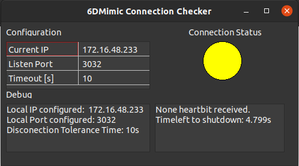

# 6DMimic Grasping Heartbit Checker

<a rel="license" href="http://creativecommons.org/licenses/by-nc-nd/4.0/">


<!-- External Links -->
[Lazarus 2.0.6 Linux 64b]:https://sourceforge.net/projects/lazarus/files/Lazarus%20Linux%20amd64%20DEB/Lazarus%202.0.6/
<!-- GitHub Links>

-->

<!-- GitLab Links-->
[6DMimic Grasping Server]:https://gitlab.inesctec.pt/CRIIS/mimicgrasping/mimic_grasping_6dmimic_interface
[LCL V2.0.6]:https://ubuntu.pkgs.org/20.04/ubuntu-universe-amd64/lcl-utils-2.0_2.0.6+dfsg-3_amd64.deb.html


## <a name="summary"></a>1. Summary


* [Overview](#overview)
* [Prerequisites](#prerequisites)
* [Running](#running)
* [Configuration](#configuration)


## <a name="overview"></a>2. Overview

Lazarus server application to monitoring the connection with [6DMimic Grasping Server].

<p align="center">
  
</p>
<p align="center">
6DMimic heartbit checker GUI.
</p>

## <a name="prerequisites"></a>3. Prerequisites

* [Lazarus 2.0.6 Linux 64b]
* LCL V2.0.6
* lnetvisual V0.6.6

## <a name="running"></a>4. Running

Clone the rep.

Setup the environment variable $6D_MIMIC_HEARTBIT_CHECKER_ROOT, such as:

```
cd $HOME
echo MIMIC_HEARTBIT_CHECKER_ROOT="{YOUR_PATH_TO}/6dmimic_hearbit_checker" >> .bashrc
echo export MIMIC_HEARTBIT_CHECKER_ROOT >> .bashrc
```

Run the ```6dmimic_heartbit_checker``` file.

If development is needed, setup all prerequisites and just open the ```6dmimic_heartbit_checker.lpi``` on Lazarus interface into  ```Tool Bar > Project > Open Project```


## <a name="configuration"></a>5. Configuration

The configuration files is placed inside the project folder, named ```config.config```. The param list is described below:
* **Current IP:** IP where the hearbit Checker is running.
* **Listen Port:** Port that the hearbit is being published.
* **Timeout [s]:** Timeout in seconds to shut down the application after miss the hearbit signal.


-----------------------------------------------------------------------------------------------------------------------------------------------------------------------------------------------------
<br />This work is licensed under a <a rel="license" href="http://creativecommons.org/licenses/by-nc-nd/4.0/">Creative Commons Attribution-NonCommercial-NoDerivatives 4.0 International License</a>.
